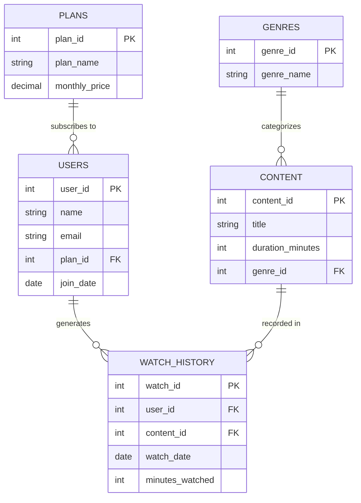

# Media Streaming Platform Database

A comprehensive SQL database design and analysis project simulating the backend of a media streaming service (like Netflix or Hulu). This repository demonstrates time-series event tracking, complex joins, aggregation analysis, and business intelligence querying for subscription and engagement metrics.

---

# 1. Database Architecture & ER Diagram

The database utilizes 5 tables, separating static lookup data (`Plans`, `Genres`) from core entities (`Users`, `Content`) and high-volume transactional event data (`Watch_History`).

## ER Diagram



---

# 2. Schema Blueprint

- **Lookup Tables:** `Plans` (Subscription Tiers), `Genres`
- **Core Entities:** `Users` (Subscriber Information), `Content` (Movies/Shows)
- **Transactional/Event Table:** `Watch_History` (Tracks exact watch dates and session durations)

---

# 3. Advanced Analytics & Business Intelligence

# 🟢 Easy: Filtering & Basic Operations

## Q1: High-Tier Subscribers

### Business Problem

Find all users currently subscribed to the `Premium 4K` tier.

```sql
SELECT name, email, join_date
FROM Users
WHERE plan_id = 3;
```

### Output

| name        | email             | join_date  |
| ----------- | ----------------- | ---------- |
| Arjun Reddy | arjun.r@gmail.com | 2023-11-01 |
| Kavya Singh | kavya.s@gmail.com | 2024-03-10 |

---

## Q2: Feature-Length Content Filter

### Business Problem

Retrieve movies/shows longer than 2 hours (120 minutes).

```sql
SELECT title, duration_minutes
FROM Content
WHERE duration_minutes > 120;
```

### Output

| title                    | duration_minutes |
| ------------------------ | ---------------- |
| The Matrix Resurrections | 148              |
| Inception                | 148              |

---

## Q3: Early Abandonment Detection

### Business Problem

Identify watch events where the viewer stopped watching before the 60-minute mark.

```sql
SELECT user_id, content_id, minutes_watched
FROM Watch_History
WHERE minutes_watched < 60;
```

### Output

| user_id | content_id | minutes_watched |
| ------- | ---------- | --------------- |
| 1       | 4          | 45              |
| 3       | 5          | 30              |

---

## Q4: Recent Acquisitions

### Business Problem

Find users who joined the streaming platform during 2024.

```sql
SELECT name, join_date
FROM Users
WHERE join_date >= '2024-01-01';
```

### Output

| name         | join_date  |
| ------------ | ---------- |
| Priya Sharma | 2024-01-15 |
| Rohan Desai  | 2024-02-20 |
| Kavya Singh  | 2024-03-10 |

---

# 🟡 Medium: Aggregations & Metrics

## Q5: Total Watch Time per User

### Business Problem

Aggregate the total minutes streamed by each user to identify the platform's heaviest streamers.

```sql
SELECT user_id, SUM(minutes_watched) AS total_minutes_streamed
FROM Watch_History
GROUP BY user_id
ORDER BY total_minutes_streamed DESC;
```

### Output

| user_id | total_minutes_streamed |
| ------- | ---------------------- |
| 1       | 288                    |
| 3       | 125                    |
| 2       | 120                    |

---

## Q6: Content Volume by Genre

### Business Problem

Count the number of titles available under each genre category.

```sql
SELECT genre_id, COUNT(content_id) AS total_titles
FROM Content
GROUP BY genre_id;
```

### Output

| genre_id | total_titles |
| -------- | ------------ |
| 1        | 2            |
| 2        | 2            |
| 3        | 1            |

---

## Q7: Estimated Monthly Recurring Revenue (MRR)

### Business Problem

Calculate the gross monthly revenue generated by each subscription tier.

```sql
SELECT p.plan_name,
       (COUNT(u.user_id) * p.monthly_price) AS total_tier_revenue
FROM Plans p
JOIN Users u
ON p.plan_id = u.plan_id
GROUP BY p.plan_name, p.monthly_price;
```

### Output

| plan_name    | total_tier_revenue |
| ------------ | ------------------ |
| Mobile Basic | 199.00             |
| Standard HD  | 499.00             |
| Premium 4K   | 1298.00            |

---

## Q8: Most Watched Content (By Total Time)

### Business Problem

Determine which content consumed the highest total watch time across the platform.

```sql
SELECT content_id,
       SUM(minutes_watched) AS global_watch_minutes
FROM Watch_History
GROUP BY content_id
ORDER BY global_watch_minutes DESC;
```

### Output

| content_id | global_watch_minutes |
| ---------- | -------------------- |
| 2          | 190                  |
| 1          | 148                  |
| 3          | 120                  |
| 4          | 45                   |
| 5          | 30                   |

---

# 🔴 Hard: Advanced Logic & Cohort Analysis

## Q9: The "Binge Drop-off" (Incomplete Watch Detection)

### Business Problem

Find users who started watching a movie/show but abandoned it before completion.

```sql
SELECT u.name,
       c.title,
       wh.minutes_watched,
       c.duration_minutes
FROM Watch_History wh
JOIN Users u
ON wh.user_id = u.user_id
JOIN Content c
ON wh.content_id = c.content_id
WHERE wh.minutes_watched < c.duration_minutes;
```

### Output

| name        | title                            | minutes_watched | duration_minutes |
| ----------- | -------------------------------- | --------------- | ---------------- |
| Arjun Reddy | Inception                        | 45              | 148              |
| Rohan Desai | Silicon Valley: The Untold Story | 30              | 110              |

---

## Q10: Platform Churn / Inactive Users

### Business Problem

Identify subscribers who have never watched any content after creating an account.

```sql
SELECT name, email
FROM Users
WHERE user_id NOT IN (
    SELECT DISTINCT user_id
    FROM Watch_History
);
```

### Output

| name        | email             |
| ----------- | ----------------- |
| Kavya Singh | kavya.s@gmail.com |

---

## Q11: Top Performing Genre by Engagement

### Business Problem

Calculate total engagement minutes by genre and identify highly engaging categories.

```sql
SELECT g.genre_name,
       SUM(wh.minutes_watched) AS total_engagement_minutes
FROM Genres g
JOIN Content c
ON g.genre_id = c.genre_id
JOIN Watch_History wh
ON c.content_id = wh.content_id
GROUP BY g.genre_name
HAVING SUM(wh.minutes_watched) > 100
ORDER BY total_engagement_minutes DESC;
```

### Output

| genre_name       | total_engagement_minutes |
| ---------------- | ------------------------ |
| Tech Documentary | 220                      |
| Sci-Fi           | 193                      |
| Action           | 120                      |

---

## Q12: Basic Recommendation Engine (Content Not Yet Watched)

### Business Problem

Recommend unwatched content to a specific user (`Arjun Reddy`) by filtering titles absent from his watch history.

```sql
SELECT c.title, g.genre_name
FROM Content c
JOIN Genres g
ON c.genre_id = g.genre_id
WHERE c.content_id NOT IN (
    SELECT content_id
    FROM Watch_History
    WHERE user_id = 1
);
```

### Output

| title                            | genre_name       |
| -------------------------------- | ---------------- |
| Mad Max: Fury Road               | Action           |
| Silicon Valley: The Untold Story | Tech Documentary |

---

# How to Run Locally

## 1. Clone the Repository

```bash
git clone https://github.com/YourUsername/media-streaming-platform-db.git
cd media-streaming-platform-db
```

---

## 2. Launch MySQL CLI

```bash
mysql -u root -p
```

---

## 3. Create the Database

```sql
CREATE DATABASE media_platform_db;
USE media_platform_db;
```

---

## 4. Execute SQL Files

```sql
SOURCE 01_schema.sql;
SOURCE 02_seed_data.sql;
SOURCE 03_queries.sql;
```

---

# Key SQL Concepts Demonstrated

- Filtering with `WHERE`
- Aggregations using `SUM()` and `COUNT()`
- Multi-table `JOIN` operations
- `GROUP BY` and `HAVING`
- Revenue analytics
- User engagement tracking
- Anti-joins using `NOT IN`
- Recommendation engine logic
- Watch retention analysis

---

# Future Improvements

- Add actor/director tables
- Implement user ratings and reviews
- Add recommendation scoring algorithm
- Introduce subscription payment history
- Build dashboard visualizations using Power BI or Tableau
- Add stored procedures and triggers

---

# Author

Developed as part of an advanced SQL database design and analytics project focused on streaming platform business intelligence and engagement tracking.
